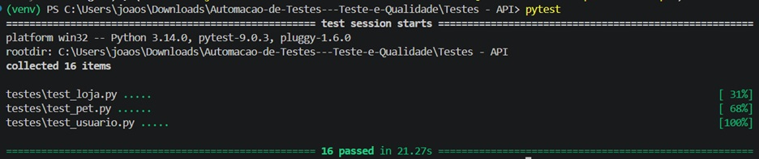
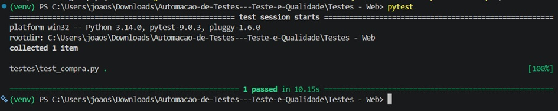
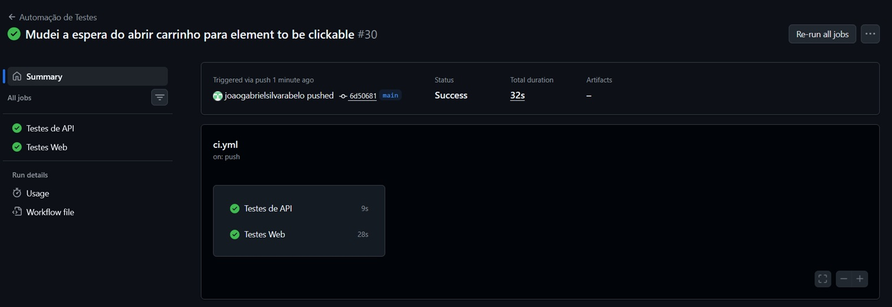

# Automação de Testes — Teste e Qualidade

Repositório único contendo dois projetos de automação de testes: cobertura completa da API Petstore (REST) e fluxo E2E na aplicação SauceDemo (Web), ambos integrados a uma pipeline de CI via GitHub Actions.

## Tecnologias utilizadas

| Projeto | Tecnologias |
|---|---|
| API | Python, Pytest, Requests |
| Web | Python, Pytest, Selenium, Webdriver Manager |
| CI/CD | GitHub Actions |

## Estrutura do repositório

```
AUTOMACAO-DE-TESTES---TESTE-E-QUALIDADE/
│
├── .github/
│   └── workflows/
│       └── ci.yml                  # Pipeline CI para ambos os projetos
│
├── Testes - API/
│   ├── testes/
│   │   ├── __init__.py
│   │   ├── test_usuario.py         # Endpoints de usuário
│   │   ├── test_pet.py             # Endpoints de pet
│   │   └── test_loja.py            # Endpoints de loja/pedidos
│   ├── config.py                   # URL da API
│   └── requirements.txt
│
├── Testes - Web/
│   ├── pages/
│   │   ├── __init__.py
│   │   ├── tela_login.py           # Page Object da tela de login
│   │   ├── tela_carrinho.py        # Page Object do carrinho
│   │   └── tela_checkout.py        # Page Object do checkout
│   ├── testes/
│   │   ├── __init__.py
│   │   └── test_compra.py          # Fluxo E2E completo
│   ├── config_web.py               # URL da aplicação web
│   ├── conftest.py                 # Fixture do driver Selenium
│   └── requirements.txt
│
├── .gitignore
└── README.md
```

---

## Projeto 1 — Automação de API (Swagger Petstore)

**URL da API:** `https://petstore.swagger.io/v2`

### Cenários cobertos

**Usuário (`test_usuario.py`)**
- Criar usuário com sucesso
- Realizar login com credenciais válidas
- Buscar usuário por username
- Atualizar usuário
- Deletar usuário

**Pet (`test_pet.py`)**
- Criar pet
- Buscar pet por ID
- Buscar pets por status
- Atualizar pet
- Deletar pet
- Confirmar retorno 404 após deleção

**Loja (`test_loja.py`)**
- Consultar inventário
- Criar pedido
- Buscar pedido por ID
- Deletar pedido
- Confirmar retorno 404 após deleção

### Instalação e execução

```bash
# Entrar na pasta do projeto
cd "Testes - API"

# Criar e ativar ambiente virtual
python -m venv venv
source venv/bin/activate       # Linux/Mac
venv\Scripts\activate          # Windows

# Instalar dependências
pip install -r requirements.txt

# Executar todos os testes
pytest testes/ -v
```

## Projeto 2 — Automação Web (SauceDemo)

**URL:** `https://www.saucedemo.com`

**Credenciais de teste:** `standard_user` / `secret_sauce`

### Cenário coberto

Fluxo E2E completo de compra:
1. Acessar a aplicação
2. Realizar login
3. Adicionar produto ao carrinho
4. Confirmar produto adicionado via badge do carrinho
5. Abrir o carrinho
6. Iniciar checkout
7. Preencher dados pessoais
8. Finalizar compra
9. Validar mensagem de sucesso

### Padrão utilizado: Page Object Model

Cada tela da aplicação possui uma classe dedicada em `pages/`, encapsulando todos os seletores e interações. Os arquivos de teste não contêm nenhuma chamada direta a `find_element`.

| Classe | Responsabilidade |
|---|---|
| `LoginPage` | Preencher credenciais, submeter login e aguardar inventário carregar |
| `CartPage` | Adicionar produto, confirmar badge, abrir carrinho e ir ao checkout |
| `CheckoutPage` | Preencher dados, aguardar navegação e finalizar compra |

Todas as interações utilizam `WebDriverWait` com `expected_conditions` para garantir estabilidade tanto em execução local quanto em CI.

### Instalação e execução

```bash
# Entrar na pasta do projeto
cd "Testes - Web"

# Criar e ativar ambiente virtual
python -m venv venv
source venv/bin/activate       # Linux/Mac
venv\Scripts\activate          # Windows

# Instalar dependências
pip install -r requirements.txt

# Executar todos os testes
pytest testes/ -v
```

> O Chrome é instalado automaticamente pelo `webdriver-manager`. Os testes rodam em modo headless por padrão.

## CI/CD — GitHub Actions

A pipeline é acionada automaticamente a cada `push` ou `pull request` e executa os dois projetos em jobs paralelos e independentes.

```
Push / Pull Request
        │
        ├── Job: Testes de API
        │     └── pytest testes/ -v
        │
        └── Job: Testes Web
              └── pytest testes/ -v
```

Para visualizar as execuções, acesse a aba **Actions** do repositório.

## Prints do funcionamento

### Testes de API passando localmente


### Testes Web passando localmente


### Pipeline CI executando com sucesso

